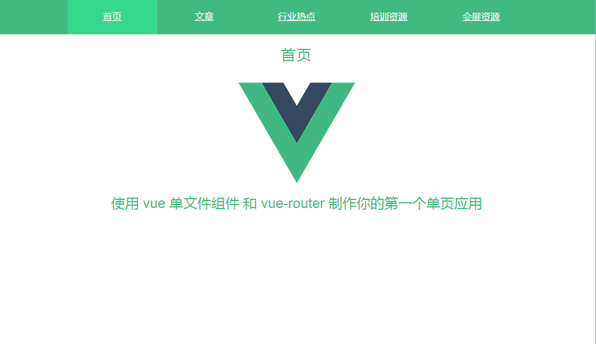
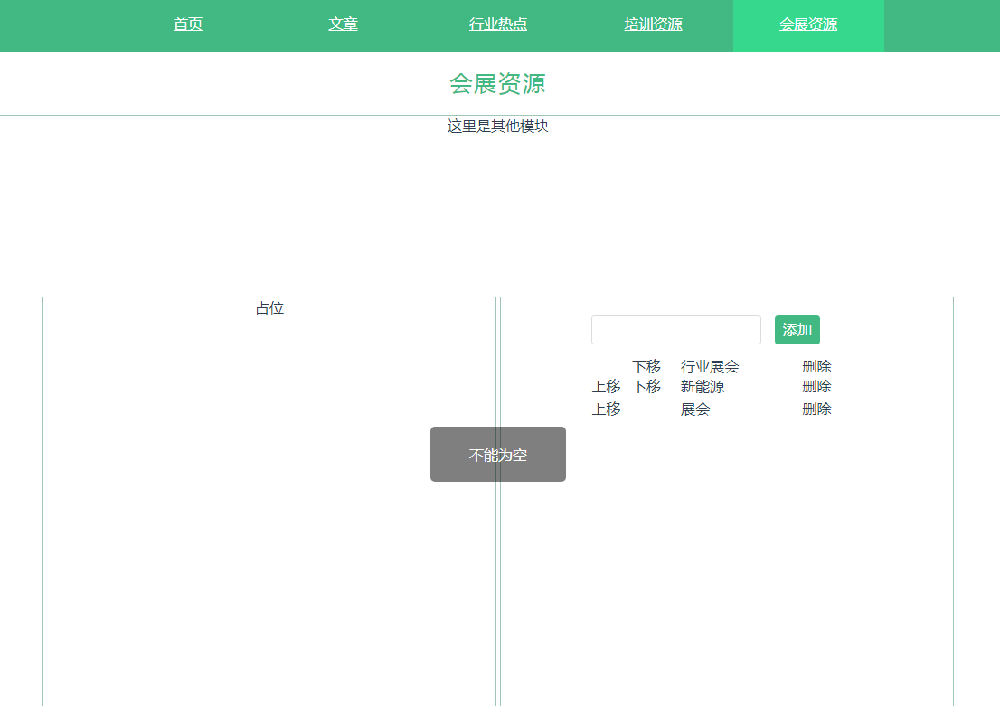

# 单文件组件-单页应用-demo

> 用.vue单文件组件和vue-router写的一个单页应用小demo

## Build Setup

``` bash
# install dependencies
npm install

# serve with hot reload at localhost:8080
npm run dev

# build for production with minification
npm run build
```

### 截图




